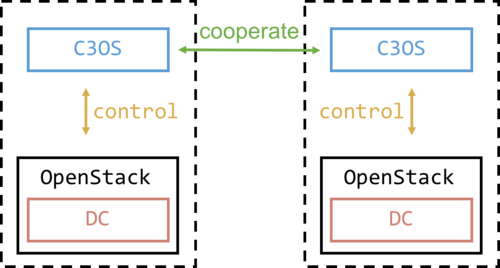

# C3OS
[](https://travis-ci.org/utam0k/c3os)
[](https://coveralls.io/github/utam0k/c3os?branch=master)

## What is C3OS?
C3OS stands for **Controller of Clustering CloudOS**.  
This softwaer manage multiple CloudOS.  
C3OS monitor and manage CloudOS.  
C3OS works as an upper layer of CloudOS.  



## For Example
There are two CloudOS called Region1 and Region2.  
If there is some fault an InstanceA with Region1 falls down.  
Region2 is able to sense it via C3OS.  
In some cases, Region2 can invoke an alternate InstanceA.  

## Support CloudOS
- OpenStack  

## Install
```
pip install -r requirements.txt
python setup.py install
```

## Feature Development
- Add supporting other CloudOS.(Introduce [libcloud](https://github.com/apache/libcloud))
- Migrating among multiple CloudOS.

## License
[MIT](https://github.com/utam0k/c3os/blob/master/LICENSE.txt)
